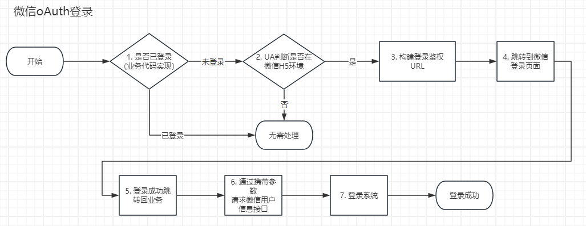

# 微信API SDK库

## 1. 安装

本SDK目前仅支持`composer`安装，如需其他安装方式，请自行下载相应库代码改造。

安装：
```shelll
composer require lfphp/wechatsdk
```

## 2. 公众号开发环境配置

### 2.1 配置基本域名信息

进入【设置与开发】 > 【账号设置】 > 【功能设置】，配置业务相关域名信息，包括：

- `业务域名`（**必须**）
- `JS接口安全域名`（**前端JS接口场景必须**）
- `网页授权域名`（**后端回调必须**）。

### 2.2 配置技术相关参数

进入 mp.weixin.qq.com ，访问【设置与开发】 > 【开发接口管理】 菜单。

- 获取开发者ID（AppID）信息
- 获取令牌（Token）
- 设置开发者密码（AppSecret）（**必须**）
- 添加后台接口访问IP白名单（**必须**）
- 配置并启用【服务器配置】中的
    - `服务器地址（URL）`（**必须**）
    - `消息加解密密钥（EncodingAESKey）`（**必须**）
    - 选择 `消息加密方式`（请使用【安全模式】，当前库大部分函数也是基于这个模式）（**必须**）。

## 2.3 验证服务器地址

假设服务器地址（URL）配置为：`https://www.site.com/callback.php`，则在 `callback.php` 代码中实现服务器校验代码示例为：

```php
<?php
use function LFPhp\WechatSdk\Util\wechat_echo_validation;

//微信接口校验模式
$token = ''; //请填入 2.2 中获取的【令牌（Token）】
if($_GET['echostr']){
    wechat_echo_validation($token);
    die;
}

//否则为微信常规回调模式
//正常微信回调业务代码···
```

## 3. 接收处理微信回调

### 3.1 获取回调数据

在上述处理响应代码中，继续追加正常微信回调业务代码：

```php
<?php
use function LFPhp\WechatSdk\Util\wechat_decode_callback;
//上接【2.3】中微信接口校验代码···

$app_id = ''; //请填入 2.2 中获取的【开发者ID（AppID）】
$token = ''; //请填入 2.2 中获取的【令牌（Token）】
$encoding_aes_key = ''; //请填入 2.2 中设置的 【消息加解密密钥（EncodingAESKey）】

//解析并获取微信回调数据 
$data = wechat_decode_callback($app_id, $token, $encoding_aes_key);

//数据调试
var_dump($data); 
```

上述代码中 `$data`
即为微信回调数组，详细格式请参考 [微信开发文档](https://developers.weixin.qq.com/doc/offiaccount/Message_Management/Receiving_standard_messages.html)

### 3.2 转换为事件对象
本SDK库封装常规事件对象，方便在实际代码中调用判断。以下示例仅以普通文本消息为例
```php
<?php
use LFPhp\WechatSdk\Message\Message\MessageText;
use LFPhp\WechatSdk\Message\MessageBase;

//上接【3.1】中回调数据获取代码
//$data 为上一步骤中解析出来的数组
$receive_msg = MessageBase::getMessageInstance($data);
if($receive_msg instanceof EventSubscribe ||
    $receive_msg instanceof EventScan){
    $success_msg = new MessageText;
    $success_msg->ToUserName = $receive_msg->FromUserName;
    $success_msg->FromUserName = $receive_msg->ToUserName;
    $success_msg->CreateTime = time();
    if($receive_msg->Ticket){
        //公众号扫码成功
    } else {
        //公众号扫码订阅成功
    }
}
```

## 4. 获取 `access_token` `js_ticket` `page_access_token`
> 公众号后端接口调用基本都依赖 `access_token`，应用需要获取 `access_token` 保存到本地，并定期刷新 `access_token` （一般有效期为 7200 s） 
> 应用H5页面js调用接口需要 js_ticket 信息（一般有效期为7200s），应用需要获取并刷新该 js_ticket
> 微信环境H5 oAuth方式登录依赖页面page_access_token(不是后端接口的access_token)

### 4.1 获取 `access_token`

```php
<?php
use LFPhp\WechatSdk\Service\Auth;

$app_id = ''; //请填入 2.2 中获取的【开发者ID（AppID）】
$app_secrect = ''; //请填入 2.2 中获取的【开发者密码（AppSecret）】
list($access_token, $expires) = Auth::getAccessToken($app_id, $app_secrect);

//todo 应用需要保存 $access_token 到本地
```

### 4.2 获取 `js_ticket`

```php
<?php
use LFPhp\WechatSdk\Service\JSAuth;

$app_id = ''; //请填入 2.2 中获取的【开发者ID（AppID）】
$app_secrect = ''; //请填入 2.2 中获取的【开发者密码（AppSecret）】
list($ticket, $expires) = JSAuth::getJsTicket($app_id, $app_secrect);

//todo 应用需要保存 $ticket 到本地
```

### 4.3 获取 page_access_token
需要微信oAuth登录流程获取微信返回code，才能获取并使用 page_access_token，
具体请见 [步骤5](#s5) 

```php
<?php
use LFPhp\WechatSdk\Service\PageAuth;

$app_id = ''; //请填入 2.2 中获取的【开发者ID（AppID）】
$app_secrect = ''; //请填入 2.2 中获取的【开发者密码（AppSecret）】
$code = $_GET['code'];  //微信登录回调code
$page_access_token = PageAuth::getAccessToken($app_id, $app_secret, $code);
```


## 5. 后端请求公众号接口

以获取公众号分享二维码为例，其他功能请参考 `Service` 下个类库方法

```php
<?php
use LFPhp\WechatSdk\Base\AuthorizedService;
use LFPhp\WechatSdk\Service\QRCode;

$access_token = ''; //读取 4.1 中本地保存的 access_token

//初始化需要鉴权的服务
//需要鉴权类的服务调用前都必须初始化access_token信息
AuthorizedService::setAccessToken($access_token);

$info = QRCode::createTemporaryQRCode($scene);

//打印二维码图像地址
var_dump($info['qrcode_url']);

//输出到html中：
echo '';
```

## 6. 页面oAuth鉴权流程 <a name="s5"></a>
微信页面登录流程示意：



以下为各个关键环节代码示意。

【2】判断是否微信H5环境：

```php
<?php 
/**
 * 判断浏览器在微信中
 * @return bool
 */
function in_wechat(){
	return !!preg_match('/MicroMessenger/i', $_SERVER['HTTP_USER_AGENT']) && !in_wework();
}

/**
 * 判断浏览器在企业微信中
 * @return bool
 */
function in_wework(){
	return !!preg_match('/wxwork/i', $_SERVER['HTTP_USER_AGENT']);
}

if(in_wechat()){
    //处于微信环境，继续处理登录逻辑【3】
}
```

【3】构建登录鉴权URL，并跳转：

```php
<?php
use LFPhp\WechatSdk\Service\PageAuth;
use function LFPhp\Func\http_redirect;
use function LFPhp\Func\http_get_current_page_url;

$app_id = ''; //请填入 2.2 中获取的【开发者ID（AppID）】
$AUTH_SCOPE = PageAuth::SCOPE_BASE; //设置为获取用户基本信息（只有openid，静默授权）
$state = ''; //填入自定义透传变量

//回调页面地址，可以自行指定需要实现回调逻辑的页面地址。如果是和跳出页面同一个，需要处理好入口分支逻辑。
$callback_url = http_get_current_page_url(); 

$login_url = PageAuth::getAuthUrl($app_id, $callback_url, $AUTH_SCOPE, $state);

//页面跳转到微信鉴权页面
http_redirect($login_url);
```

【6】解析微信登录回调数据

```php
<?php
use LFPhp\WechatSdk\Service\PageAuth;

$app_id = ''; //请填入 2.2 中获取的【开发者ID（AppID）】
$app_secrect = ''; //请填入 2.2 中获取的【开发者密码（AppSecret）】

$state = ''; //这里state为【3】中填入的透传变量，如果没有设置可以不用判断
$code = $_GET['code'];

//简单判断是否为合法微信回调
if($_GET['state'] == $state && $code){
    
	//获取页面access token信息    
    $page_access_token_info = PageAuth::getAccessToken($app_id, $app_secret, $code);
    
    $open_id = $page_access_token_info['openid'];
    
    //如果登录SCOPE为userinfo，拉取更多用户信息，否则没有更多用户信息
    $wechat_user_info = [];
    if($scope === PageAuth::SCOPE_USERINFO){
        $wechat_user_info = PageAuth::getSnsUserInfo($page_access_token_info['access_token'], $open_id);
    }

    //【7】todo 业务代码自行实现登录逻辑
    login_by_open_id($open_id);
    
    //登录成功，接下来可以选择跳转回业务首页，或者业务自定义处理逻辑
}
```


## 7. 前端JS调用
前端JS调用微信前端能力，需要通过步骤3.2 获取到可用 `js_ticket`

### 7.1 前端微信JSSDK初始化
前端初始化代码如下：
```php
<?php
use LFPhp\WechatSdk\Service\JSAuth;
use function LFPhp\Func\http_get_current_page_url;

$app_id = ''; //请填入 2.2 中获取的【开发者ID（AppID）】

//请填入 4.2 存储的有效 js_ticket
$js_ticket = '';

//快速计算前端初始化相关信息
$config_info = JSAuth::generateJsSignatureSimple($js_ticket, http_get_current_page_url());
?>
    
<!-- HTML 代码部分 -->
<!-- 引入微信JSSDK -->
<script src="https://res.wx.qq.com/open/js/jweixin-1.6.0.js">
<script>
	const WECHAT_JS_CONFIG = {
		debug: false,
		appId: '$app_id',
		timestamp: <?=$config_info['timestamp'];?>,
		nonceStr: '<?=$config_info['noncestr'];?>',
		signature: '<?=$config_info['signature'];?>',
		jsApiList: [ //需要的js api接口列表，可自行增减
			'updateAppMessageShareData', //分享微信好友
			'updateTimelineShareData' //分享朋友圈
		]
	};
	//执行微信JSSDK初始化
	wx.config(WECHAT_JS_CONFIG);
</script>
```
### 7.2 前端微信接口调用
在上一步前端初始化代码后，可通过 `wx.ready()` 方法判断是否初始化完成，完成后可以调用相应微信前端接口
以下仅以微信分享来举例：

```html
<!-- 这部分代码必须在步骤 7.1之后执行 -->
<script>
wx.ready(()=>{
  wx.updateAppMessageShareData({
    title: '', //填入页面标题
    desc: '', //填入页面描述
    link: '', //分享页面地址，一般为当前页面
    imgUrl: '', //分享页面缩略图,
    success: function(){
		//成功回调
        console.log('微信分享好友信息设置成功');
    }
  });
});
</script>
```
## 8.微信支付
微信支付需要使用到微信支付平台申请的商户号，具体请参考微信支付官方文档
以下为当前库涉及微信支付需要配置项：
```php
$merchant_info = [
    'app_id' => '', //「应用ID」
    'merchant_id' => '', //「商户号」
    'merchant_certificate_serial' => '', //「商户API证书」的「证书序列号」
    'merchant_private_key_file' => 'abc.pem', //商户API证书文件
    'platform_certificate_serial' => '', //「微信支付平台证书」的「平台证书序列号」, 可以从「微信支付平台证书」文件解析，也可以在 商户平台 -> 账户中心 -> API安全 查询到
    'platform_certificate_file' => '', //从本地文件中加载「微信支付平台证书」，可由内置CLI工具下载到，用来验证微信支付应答的签名
    'platform_public_key_id' => '', //「微信支付公钥」的「微信支付公钥ID」，需要在 商户平台 -> 账户中心 -> API安全 查询
    'platform_public_key_file' => 'puk.pem', //从本地文件中加载「微信支付公钥」，用来验证微信支付应答的签名
];
```

### 8.1 支付配置初始化

```php
//初始化外部浏览器微信支付
NativePay::setMerchantInfo($merchant_info);

//初始化微信内嵌H5环境微信支付
//todo
```

### 8.2 支付、退款、查询订单（以native环境为例）
```php
<?php
use LFPhp\WechatSdk\Service\NativePay;

//【1】生成支付订单
$qrcode_url = NativePay::makeOrder([
    'out_trade_no' => 'abc123',
    'notify_url' => '',
    'product_name' => 'text',
    'amount' => 1,
]);

//支付二维码，可以使用QRCode相关代码库实现
var_dump($qrcode_url);

//【2】查询订单
$order_info = NativePay::queryOrderByOutTradeNo('abc123');

//【3】申请退款
$refund_info = NativePay::applyRefund([
  "out_trade_no"=> "1217752501201407033233368018",
  "out_refund_no"=> "1217752501201407033233368018",
  "total" => 1,
  "amount" => 1
]);

## 9. 其他场景应用
1. [公众号扫码订阅方式登录](./mp_subscribe_login.md)
//todo
